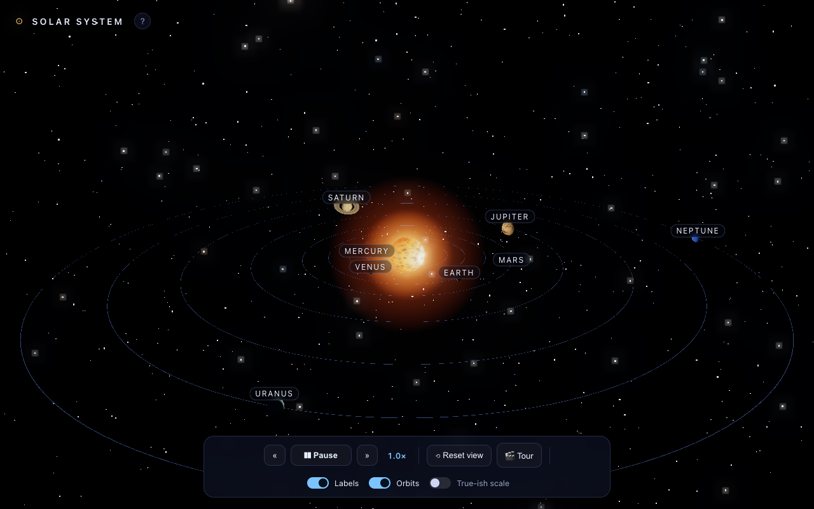

# 3D Interactive Solar System

An explorable, animated 3D solar system you can fly around, inspect, and control
time in. Built for the `opus-4.8-max` model test from
[`brief-solar-system.md`](../../brief-solar-system.md).



## Run it

It's a static site with no build step — just serve the folder and open it:

```bash
# from the repo root
python3 -m http.server 8000
# then visit http://localhost:8000/modeltest/opus-4.8-max/
```

Three.js is loaded from a CDN via an ES-module import map, so an internet
connection is required the first time. Any modern browser with WebGL works.

## Controls

- **Drag** to orbit · **scroll / pinch** to zoom · **right-drag** to pan.
- **Click a planet** (or its label) to smoothly focus it and open an info panel.
- **Space** pause/play · **← / →** slow down / speed up · **R** reset the view ·
  **T** guided tour · **Esc** deselect.
- The bottom dock toggles **labels**, **orbit paths**, and **true-ish scale**
  (readable spacing vs. the real emptiness of space).

## What's inside

- Sun at the center with a point light, an additive corona, and **bloom** glow.
- All eight planets, each **orbiting** and **rotating** with realistic relative
  periods, sizes, axial tilts (including Venus's and Uranus's extreme tilts).
- **Procedural canvas textures** for every body — banded gas giants with a Great
  Red Spot, cratered rocky worlds, a blue-marble Earth, and a turbulent Sun.
- Saturn's and Uranus's **rings**, plus the **Moon**, **Io**, **Europa**, and
  **Titan**.
- A multi-layer **starfield**, atmospheric rims on Earth and Venus, orbit paths,
  floating labels, a **guided tour**, and full time controls.

## Files

| File | Purpose |
| --- | --- |
| `index.html` | Markup, UI overlay, and the Three.js import map. |
| `style.css` | Dark, glassy space UI. |
| `main.js` | Scene graph, procedural textures, camera/selection, controls. |

## Tech

Three.js r160 (`OrbitControls`, `EffectComposer` + `UnrealBloomPass`,
`CSS2DRenderer`). No bundler, no dependencies to install.
